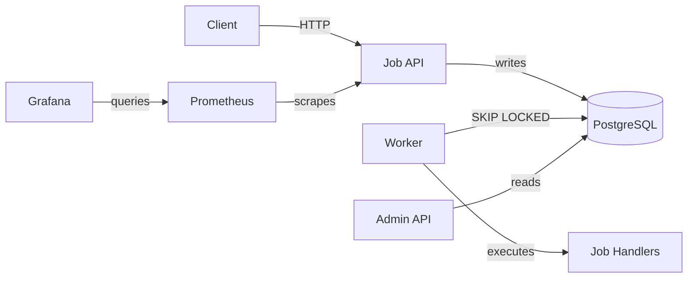

# QueueForge

[](https://github.com/Thaelith/QueueForge/actions/workflows/ci.yml)


A production-style distributed job queue built with Java 21, Spring Boot, and PostgreSQL.

## Overview

QueueForge is a durable background job queue where API clients submit jobs, worker nodes lease and execute them safely using PostgreSQL row locking, and operators observe queue health through metrics, logs, and an admin API.

Inspired by Sidekiq, Celery, and BullMQ — built to demonstrate backend system design, clean architecture, database-level concurrency, reliable retries, and strong observability.

## Architecture



## Features

- **Job Submission API** — submit, list, fetch jobs with validation and idempotency keys
- **Worker Leasing** — `SELECT ... FOR UPDATE SKIP LOCKED` for safe concurrent job claiming
- **Retry & Dead-Letter** — exponential backoff, automatic dead-letter on max attempts
- **Background Worker Loop** — configurable `@Scheduled` polling with multi-queue support
- **Stale Lease Recovery** — automatic recovery of jobs from crashed workers
- **Admin API** — dashboard summary, queue stats, worker visibility, job event timeline
- **Job Actions** — requeue, cancel, retry-now from admin endpoints
- **Observability** — Prometheus metrics, Grafana dashboard, structured MDC logging
- **Dockerized** — Docker Compose with PostgreSQL, app, Prometheus, Grafana
- **CI/CD** — GitHub Actions with unit + integration tests
- **No external deps** — PostgreSQL only, no Redis/Kafka needed

## Quick Start

```bash
# Start PostgreSQL
docker compose up -d postgres

# Build and run
./gradlew bootRun

# Or run everything via Docker
docker compose up --build app

# Swagger UI
open http://localhost:8080/swagger-ui.html

# Admin Dashboard
cd dashboard && npm install && npm run dev
open http://localhost:5173
```

## Full-Stack Demo Flow

```bash
# 1. Start DB
docker compose up -d postgres

# 2. Start backend
./gradlew bootRun

# 3. Start frontend
cd dashboard && npm install && npm run dev

# 4. Open http://localhost:5173
# 5. Submit jobs via API, click "Run Once" in settings, refresh dashboard
```

## Docker Compose

```bash
# Just the database
docker compose up -d postgres

# Database + app
docker compose up --build app

# Database + app + Prometheus + Grafana
docker compose --profile observability up --build

# Grafana: http://localhost:3000 (admin/admin)
# Prometheus: http://localhost:9090
```

## API Endpoints

| Method | Path | Phase |
|--------|------|-------|
| `POST` | `/api/v1/jobs` | Submit a job |
| `GET` | `/api/v1/jobs/{id}` | Get job details |
| `GET` | `/api/v1/jobs` | List jobs (filter by queue, status, type) |
| `GET` | `/api/v1/workers/config` | Worker configuration |
| `POST` | `/api/v1/workers/{id}/run-once` | Trigger one poll cycle |
| `POST` | `/api/v1/workers/{id}/lease` | Manual single-job lease |
| `POST` | `/api/v1/workers/recover-leases` | Manual lease recovery |
| `GET` | `/api/v1/admin/dashboard/summary` | Dashboard overview |
| `GET` | `/api/v1/admin/queues/stats` | Per-queue statistics |
| `GET` | `/api/v1/admin/workers` | Worker visibility |
| `GET` | `/api/v1/admin/jobs/{id}/events` | Job event timeline |
| `POST` | `/api/v1/admin/jobs/{id}/requeue` | Requeue dead-letter |
| `POST` | `/api/v1/admin/jobs/{id}/cancel` | Cancel job |
| `POST` | `/api/v1/admin/jobs/{id}/retry-now` | Immediate retry |
| `GET` | `/actuator/health` | Health check |
| `GET` | `/actuator/prometheus` | Prometheus metrics |

## Demo Flow

```bash
# 1. Start infrastructure
docker compose up -d postgres
./gradlew bootRun &

# 2. Submit a job
curl -X POST localhost:8080/api/v1/jobs \
  -H "Content-Type: application/json" \
  -d '{"queue":"default","type":"example.log","payload":{"msg":"hello"}}'

# 3. Process it
curl -X POST localhost:8080/api/v1/workers/worker-1/run-once

# 4. Submit a failing job with 2 attempts
curl -X POST localhost:8080/api/v1/jobs \
  -H "Content-Type: application/json" \
  -d '{"queue":"default","type":"example.fail","payload":{"message":"test"},"maxAttempts":2}'

# 5. Process it twice → dead-lettered
curl -s -X POST localhost:8080/api/v1/workers/worker-1/run-once

# 6. Requeue the dead-lettered job
curl -X POST localhost:8080/api/v1/admin/jobs/{id}/requeue \
  -H "Content-Type: application/json" -d '{"resetAttempts":true}'

# 7. Check dashboard
curl localhost:8080/api/v1/admin/dashboard/summary | jq

# 8. View Prometheus metrics
curl localhost:8080/actuator/prometheus | grep queueforge
```

## Configuration

Key settings in `application.yml` under `queueforge`:

| Setting | Default | Description |
|---------|---------|-------------|
| `worker.enabled` | `false` | Enable background polling |
| `worker.queues` | `[default]` | Queues to poll |
| `worker.poll-interval-ms` | `1000` | Time between poll cycles |
| `worker.max-jobs-per-poll` | `5` | Max jobs per poll cycle |
| `worker.lease-duration-seconds` | `30` | How long a lease lives |
| `recovery.interval-ms` | `30000` | Stale lease recovery interval |
| `retry.base-delay-seconds` | `10` | Base exponential backoff |
| `retry.max-delay-seconds` | `300` | Max backoff cap |
| `cleanup.enabled` | `false` | Enable old job cleanup |
| `cleanup.completed-retention-days` | `7` | Keep completed jobs for N days |

## Running Tests

```bash
./gradlew test                          # unit tests (no Docker)
./gradlew integrationTest               # integration tests (Docker required)
./gradlew clean test integrationTest    # all tests
```

## Project Structure

```
src/main/java/com/queueforge/
├── api/              REST controllers + DTOs
│   └── dto/
├── application/      Use cases + orchestration
├── config/           Spring config + properties
├── domain/           Domain models + enums
└── infrastructure/   Repository interfaces + JDBC impls
    └── persistence/
src/test/java/        Unit + integration tests
docs/                 Architecture, leasing, observability docs
observability/        Prometheus + Grafana configs
```

## Docs

- [Architecture](docs/ARCHITECTURE.md)
- [Worker Leasing](docs/WORKER_LEASING.md)
- [Observability](docs/OBSERVABILITY.md)
- [API Examples](docs/API_EXAMPLES.md)

## Design Tradeoffs

**PostgreSQL as queue:** No external broker needed. `SKIP LOCKED` handles concurrent workers. Scales for most internal systems. Not Kafka-level throughput.

**At-least-once delivery:** Exactly-once is hard in distributed systems. QueueForge guarantees at-least-once. Handlers should be idempotent.

**Polling vs push:** Polling is simple and reliable. Future: PostgreSQL `LISTEN/NOTIFY` for push-based latency improvements.

## Implemented Phases

- **Phase 1** — Foundation: API, persistence, Flyway, domain model, tests
- **Phase 2** — Worker Leasing: SKIP LOCKED, retry, dead-letter, concurrency safety
- **Phase 3** — Background Worker: `@Scheduled` loop, demo handlers, metrics, run-once
- **Phase 4** — Admin API: dashboard, queue stats, workers, events, requeue/cancel/retry
- **Phase 5** — Production Polish: CI/CD, Docker, Prometheus/Grafana, MDC logs, cleanup

## License

MIT
