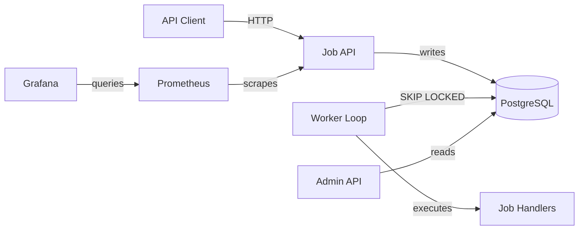

# Architecture

## Components



## Package Structure

```
com.queueforge
├── api/                 HTTP controllers, DTOs, exception handlers
│   └── dto/
├── application/         Use cases and orchestration
├── config/              Spring config, properties binding
├── domain/              Core domain models, enums, exceptions
└── infrastructure/
    └── persistence/     Repository interfaces, JDBC implementations
```

## Data Flow

1. Client submits job via `POST /api/v1/jobs` → `SubmitJobUseCase` → `jobs` table
2. `BackgroundWorkerRunner` polls on interval → `WorkerService.processJobs()`
3. `WorkerService` calls `JobRepository.leaseNextAvailable()` with `SELECT ... FOR UPDATE SKIP LOCKED`
4. If job leased: looks up `JobHandler` via registry, executes, marks completed or failed
5. Failed jobs get `RETRY_SCHEDULED` with exponential backoff, or `DEAD_LETTERED` at max attempts
6. Expired leases recovered by scheduled task → jobs reset to `PENDING`
7. Admin endpoints query aggregated stats, event timeline, worker visibility

## Why PostgreSQL SKIP LOCKED

`SELECT ... FOR UPDATE SKIP LOCKED` is PostgreSQL's lock-free concurrent work queue pattern:

- Multiple workers can poll the same queues simultaneously
- Each worker locks exactly one available row per lease call
- Workers skip rows already locked by other concurrent transactions
- No external coordination (no Redis, no ZooKeeper) needed
- `locked_until` provides lease timeouts for crash recovery
- PostgreSQL is already the source of truth — no sync gap between queue broker and DB

## Technology Choices

| Concern | Choice | Why |
|---------|--------|-----|
| Language | Java 21 | Virtual threads, records, pattern matching |
| Framework | Spring Boot 3.3 | Battle-tested, actuator, ecosystem |
| DB | PostgreSQL 16 | JSONB, SKIP LOCKED, transactional |
| Migration | Flyway | Versioned, simple, SQL-first |
| Persistence | Spring JDBC | Full SQL control, no ORM magic |
| Metrics | Micrometer + Prometheus | Standard Spring Boot observability |
| Testing | JUnit 5 + Testcontainers | Real PostgreSQL in CI |
| Build | Gradle | Wrapper, caching, fast incremental |
| CI | GitHub Actions | Free for public repos |
