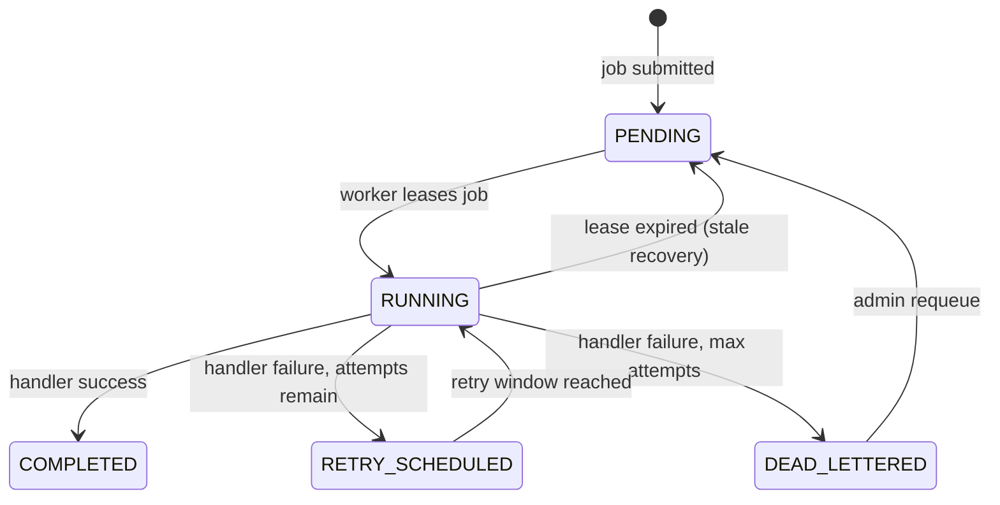

# Worker Leasing

## Lease Lifecycle



## How Leasing Works

```sql
WITH selected AS (
    SELECT id FROM jobs
    WHERE status IN ('PENDING', 'RETRY_SCHEDULED')
      AND run_at <= now()
      AND queue_name = ?
      AND (locked_until IS NULL OR locked_until < now())
    ORDER BY priority DESC, created_at ASC
    LIMIT 1
    FOR UPDATE SKIP LOCKED
)
UPDATE jobs SET
    status = 'RUNNING',
    locked_by = ?,
    locked_until = now() + ?::interval,
    attempts = attempts + 1,
    updated_at = now()
FROM selected WHERE jobs.id = selected.id
RETURNING jobs.*;
```

Key properties:
- **Single SQL statement** — lease atomically selects, locks, and updates
- **SKIP LOCKED** — never blocks waiting for another transaction
- **FOR UPDATE** — row-level lock prevents concurrent modification
- **RETURNING** — returns the leased job to the worker

## Ownership Safety

All state-changing operations check worker ownership:

```sql
-- markCompleted
UPDATE jobs SET status = 'COMPLETED' ... WHERE id = ? AND locked_by = ? AND status = 'RUNNING'

-- markFailed
UPDATE jobs SET ... WHERE id = ? AND locked_by = ? AND status = 'RUNNING'
```

A stale worker (expired lease) cannot complete another worker's job.

## Lease Expiration Recovery

```sql
UPDATE jobs SET status = 'PENDING', locked_by = NULL ...
WHERE status = 'RUNNING' AND locked_until < now()
```

Runs every 30s (configurable). Resets stuck jobs so they can be re-leased.

**Important:** Stale recovery can cause duplicate execution. QueueForge provides **at-least-once** semantics. Handlers should be idempotent.

## Retry Behavior

| Attempt | Backoff Delay |
|--------:|--------------:|
| 1 | 10s |
| 2 | 20s |
| 3 | 40s |
| 4 | 80s |
| 5+ | caps at 300s |

Formula: `min(baseDelay * 2^(attempt-1), maxDelay)`

## Limitations

- At-least-once delivery (handlers must be idempotent)
- No strict global ordering
- Single database instance (no multi-DC replication)
- Polling model (future: LISTEN/NOTIFY)
- No job cancellation mid-execution (only pre-lease cancel)
